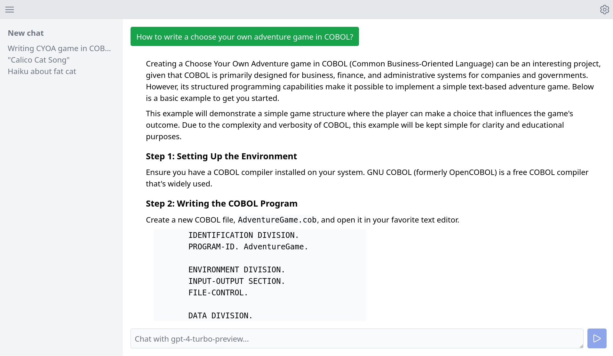

#  AI Chat

### 🔗 [aichat.ksdev.pl](https://aichat.ksdev.pl)



Yet another AI chat with original name. Currenly connects only to OpenAI models.

Works purely in the browser, with no backend/server communication. Data is stored locally in IndexedDB.

I coded it for my own use.

### Project Setup

```sh
npm install
```

### Compile and Hot-Reload for Development

```sh
npm run dev
```

### Type-Check, Compile and Minify for Production

```sh
npm run build
```

### Run with Docker

```sh
docker compose up # http://localhost:5173
```

With a custom port:

```sh
PORT=8080 docker compose up
```
